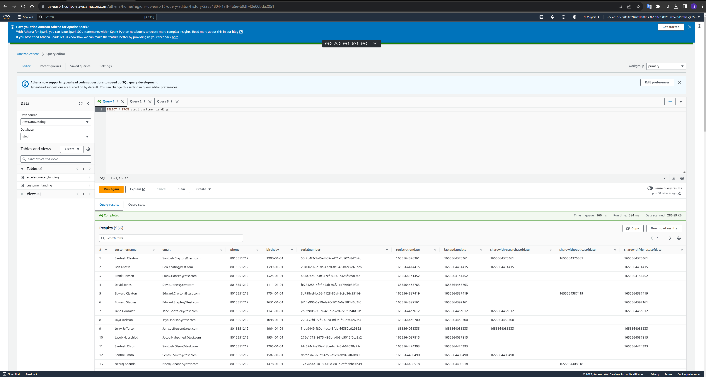
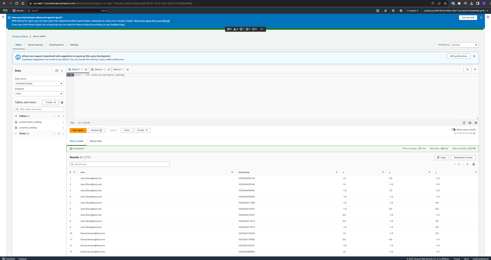
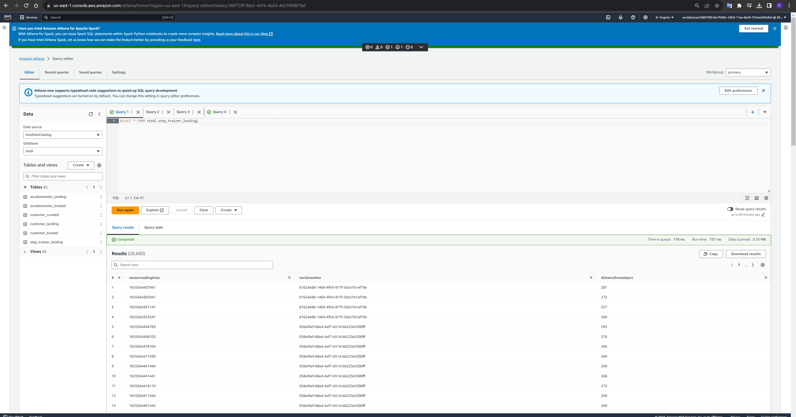
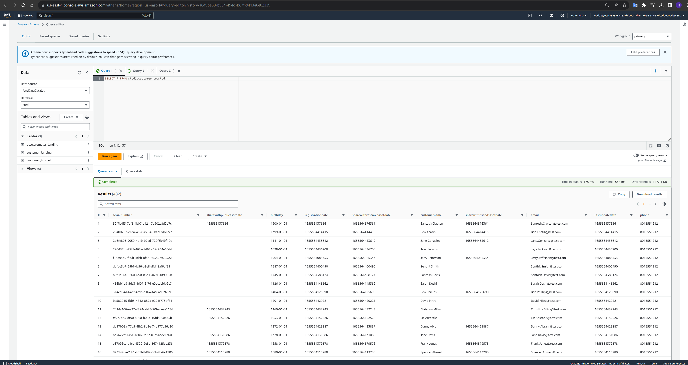
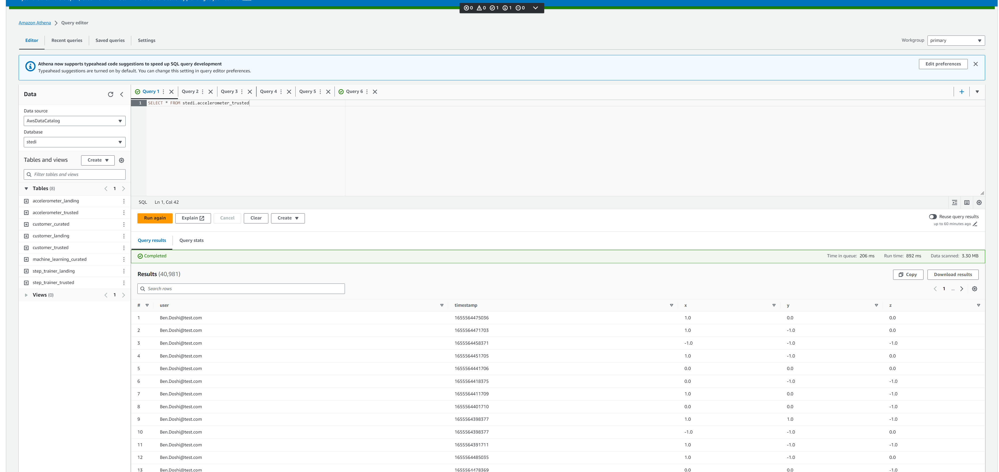
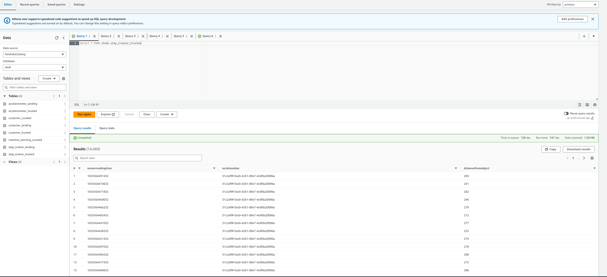
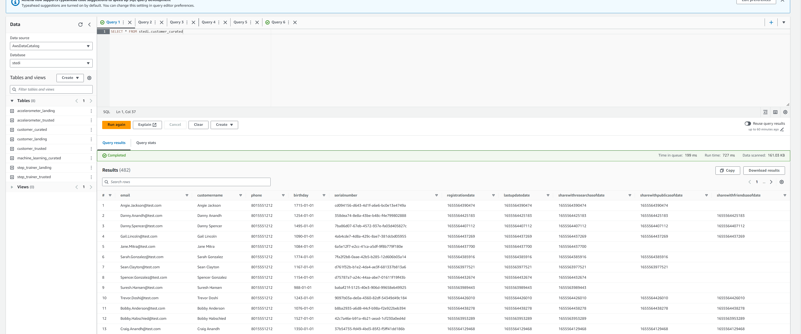
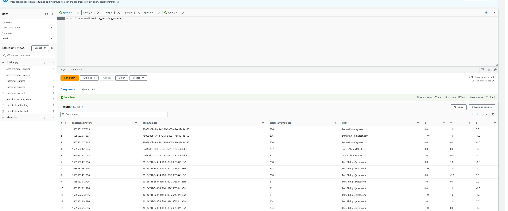

# STEDI Human Balance Analytics

## Contents

- [Introduction](#Introduction)
- [Project Datasets](#Project-Datasets)
- [Project Files](#Project-Files)

---

## Introduction

### Problem Statement

The STEDI Team has been hard at work developing a hardware STEDI Step Trainer that:

- trains the user to do a STEDI balance exercise
- has sensors on the device that collect data to train a machine-learning algorithm to detect steps
- has a companion mobile app that collects customer data and interacts with the device sensors

STEDI has heard from millions of early adopters who are willing to purchase the STEDI Step Trainers and use them.

Several customers have already received their Step Trainers, installed the mobile application, and begun using them together to test their balance. The Step Trainer is just a motion sensor that records the distance of the object detected. The app uses a mobile phone accelerometer to detect motion in the X, Y, and Z directions.

The STEDI team wants to use the motion sensor data to train a machine learning model to detect steps accurately in real-time. Privacy will be a primary consideration in deciding what data can be used.

Some of the early adopters have agreed to share their data for research purposes. Only these customers’ Step Trainer and accelerometer data should be used in the training data for the machine learning model.

---

### Project Discription

As a data engineer on the STEDI Step Trainer team, I extracted data produced by the STEDI Step Trainer sensors and the mobile app, and curated them into a data lakehouse solution on AWS. The intent is for Data Scientists to use the solution to train machine learning models.

---

### Project Environment

The Data lakehouse is developed using AWS Glue, AWS S3, Python, and Spark for sensor data that curates the data for the machine learning model.

---

## Project Datasets

STEDI has three JSON data sources to use from the Step Trainer

- Customer Records:
  - from fulfillment and the STEDI website.
  - AWS S3 Bucket URI - s3://cd0030bucket/customers/
- Step Trainer Records:
  - data from the motion sensor.
  - AWS S3 Bucket URI - s3://cd0030bucket/step_trainer/
- Accelerometer Records:
  - data from the mobile app.
  - AWS S3 Bucket URI - s3://cd0030bucket/accelerometer/

---

## Project Files

Landing Zone

> In the Landing Zone I stored the customer, accelerometer and step trainer raw data in AWS S3 bucket.

1- Customer Landing Table:
[customer_landing.sql](DDL/customer_landing.sql) - This script create glue table from raw data files.

2- Accelerometer Landing Table:
[accelerometer_landing.sql](DDL/accelerometer_landing.sql) - This script create glue table from raw data files.

3- Step Trainer Landing Table:
[step_trainer_landing.sql](DDL/step_trainer_landing.sql) - This script create glue table from raw data files.

Trusted Zone

> In the Trusted Zone, I created AWS Glue jobs to make transofrmations on the raw data in the landing zones.

**Glue job scripts**

[1. customer_landing_to_trusted.py](Jobs/customer_landing_to_trusted.py) - This script transfers customer data from the 'landing' to 'trusted' zones. It filters for customers who have agreed to share data with researchers.

[2. accelerometer_landing_to_trusted_zone.py](Jobs/accelerometer_landing_to_trusted_zone.py) - This script transfers accelerometer data from the 'landing' to 'trusted' zones. Using a join on customer_trusted and accelerometer_landing, It filters for Accelerometer readings from customers who have agreed to share data with researchers.

[3. step_trainer_landing_to_trusted.py](Jobs/step_trainer_landing_to_trusted.py) - This script transfers Step Trainer data from the 'landing' to 'trusted' zones. Using a join on customer_curated and step_trainer_landing, It filters for customers who have accelerometer data and have agreed to share their data for research with Step Trainer readings.

Curated Zone

> In the Curated Zone I created AWS Glue jobs to make further transformations, to meet the specific needs of a particular analysis.

**Glue job scripts**

[customer_trusted_to_curated.py](Jobs/customer_trusted_to_curated.py) - This script transfers customer data from the 'trusted' to 'curated' zones. It filters for customers with Accelerometer readings and have agreed to share data with researchers.

[step_trainer_trusted_to_curated.py](Jobs/step_trainer_trusted_to_curated.py): This script is used to build aggregated table that has each of the Step Trainer Readings, and the associated accelerometer reading data for the same timestamp, but only for customers who have agreed to share their data.

